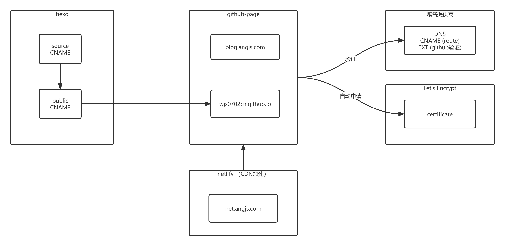

# 流程图

## 说明
1. hexo 提供了一个把markdown语法文件（在source目录）转成静态文件（默认是public目录）的工具。
2. github-page服务。
   * 可以创建一个"<用户名>.github.io"的项目（例如wjs0702cn.github.io），把hexo public目录的内容推送这个项目。 通过"https://<用户名>.github.io" 来访问这些内容。
3. github-page 提供自定义的域名。 
   * 可以通过 https://github.com/settings/pages 添加自定义的域名。 这一步需要同步在域名提供商的DNS中设置相应的内容。
   * 在"<用户名>.github.io"项目中设置CNAME。 CNAME文件中只要填写完整自定义域名（blog.angjs.com）即可。 
   * 通过验证的域名，可以"<用户名>.github.io"项目的设置中设置"Enforce HTTPS",设置了以后访问域名会自动跳转到https。 
   * 自定义域名的https-certificate是github-page服务从Let's Encrypt中申请的。
4. netlify （CDN） 加速， 参考https://blog.csdn.net/huiruwei1020/article/details/107728435

# 本blog的搭建步骤
## 安装hexo
1. 文档 https://hexo.io/zh-cn/docs/
2. 安装 hexo deploy工具 https://hexo.io/zh-cn/docs/one-command-deployment
3. 安装next主题, npm install hexo-theme-next

## 配置hexo
大部分文档已经跟随git上传到了github
需要改动的地方:
* 去掉 "嗯..! 目前共计 *** 篇日志。 继续努力。"

删除node_modules/hexo-theme-next/layout/archive.njk 中 'keep_on' 那一行。

