# 能成事的表达课笔记
最近学习了一门课程， 叫 "能成事的表达课" 是讲述沟通方面的课程。

这门课程在讲述的风格是 描述有问题的现象-->讲道理-->讲解决方法。
并且始终把合作思维放在第一位。能转变人的观念，比较实用。

本人做了一些笔记。这个笔记的目的是方便自己回忆课程的内容。 

# 课程笔记
## 01-向上汇报
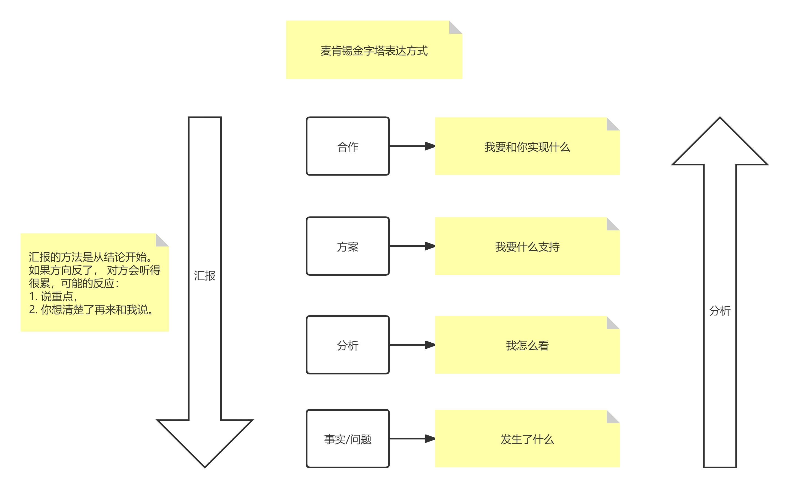
## 02-接受任务的处理方式
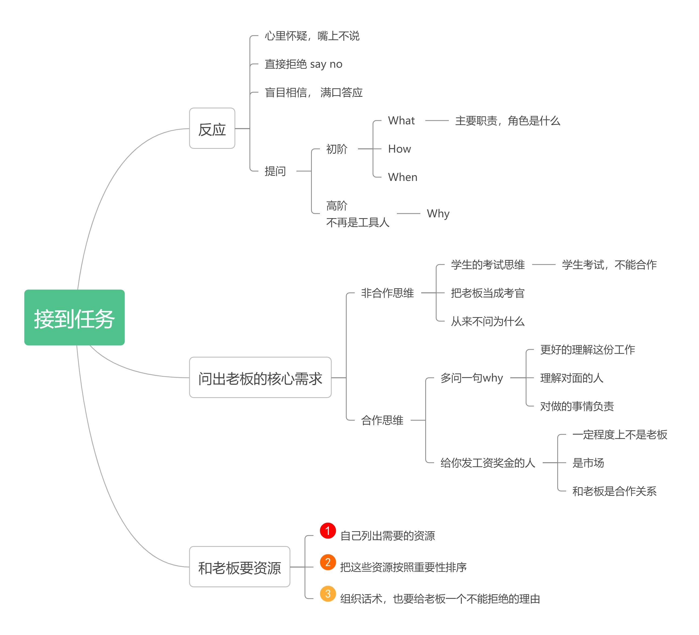
## 03-A-面对批评
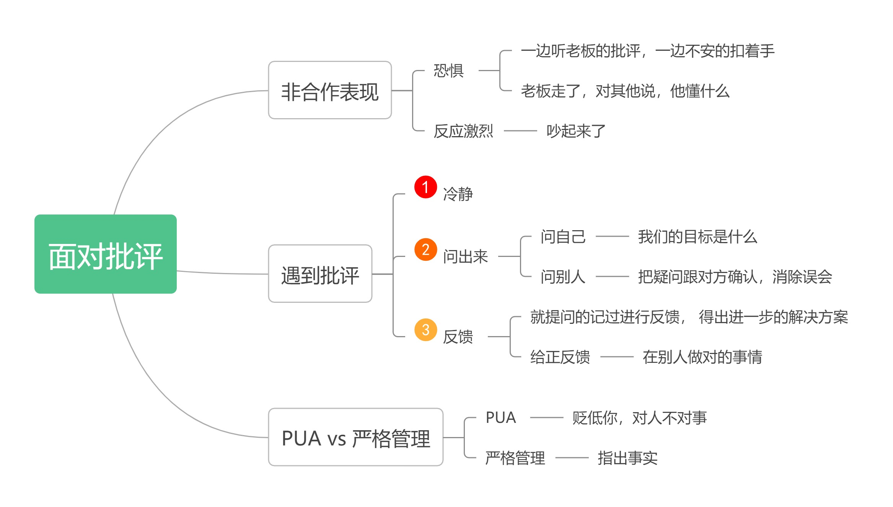
## 03-B-批评别人
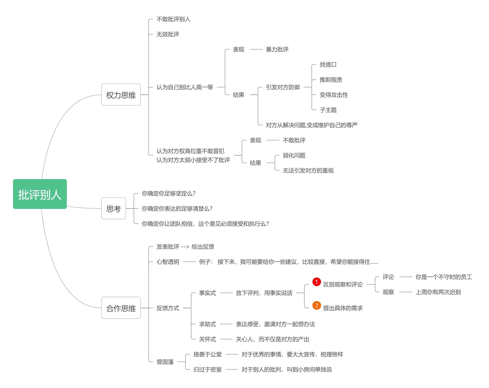
## 04-提需求
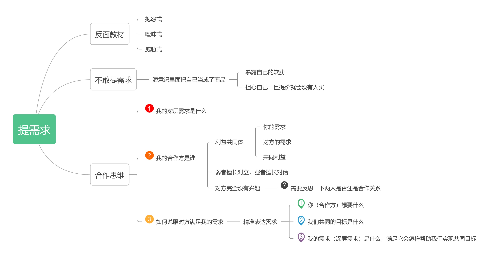
## 05-开会
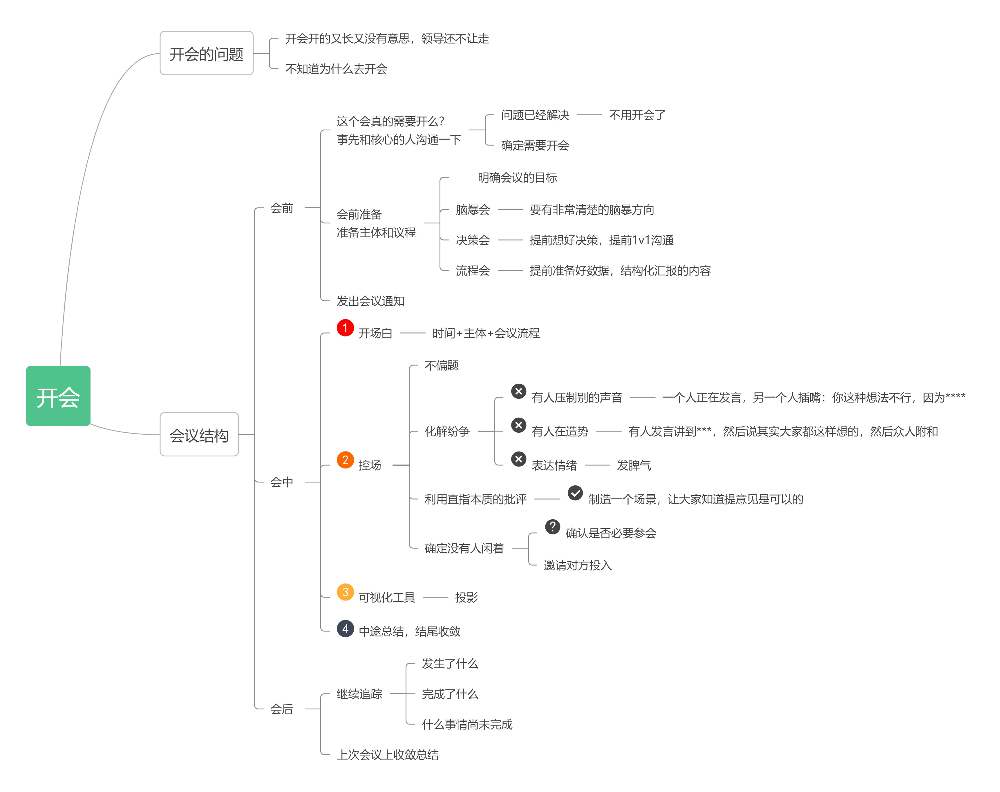
## 06-拒绝别人
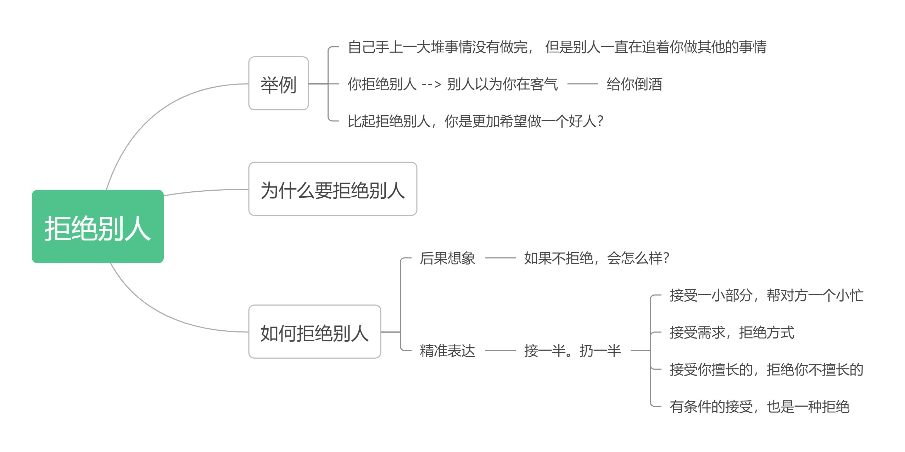
## 07-冲突
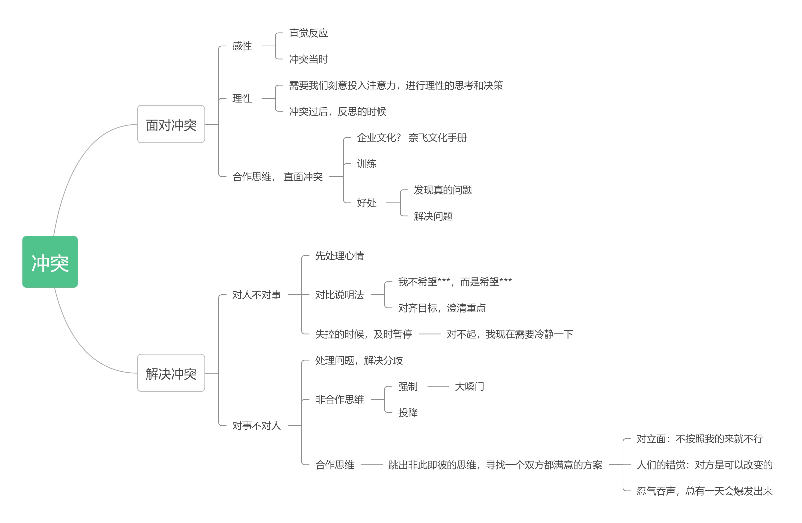
## 08-让下属愿意听你的
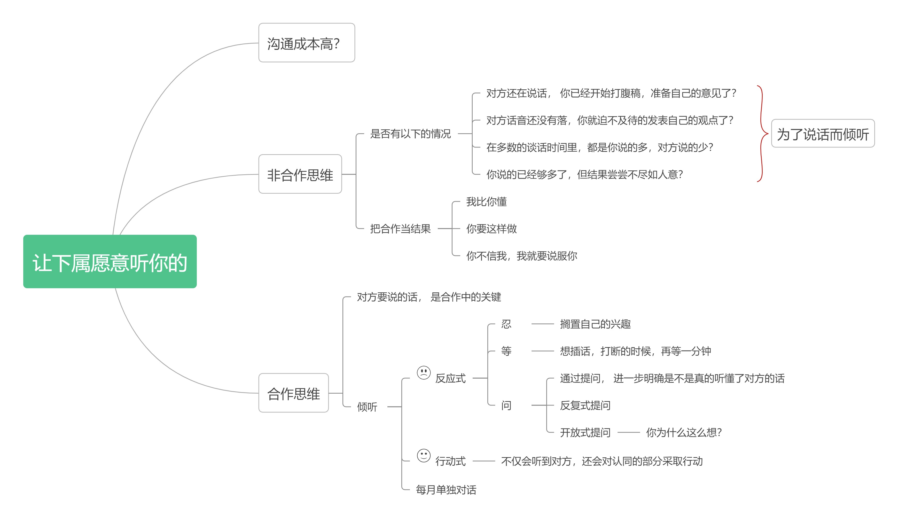
## 10-把话说到下属心里去
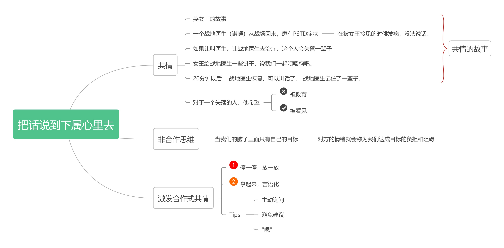
## 12-生动表达
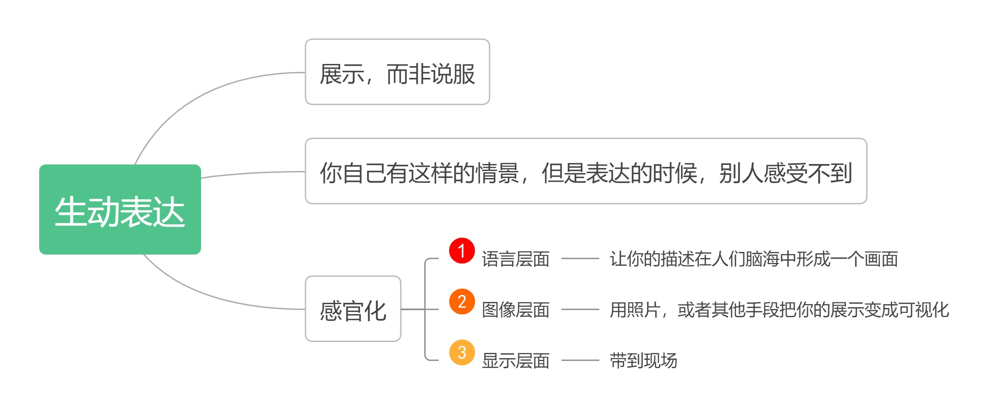
## 13-即兴表达
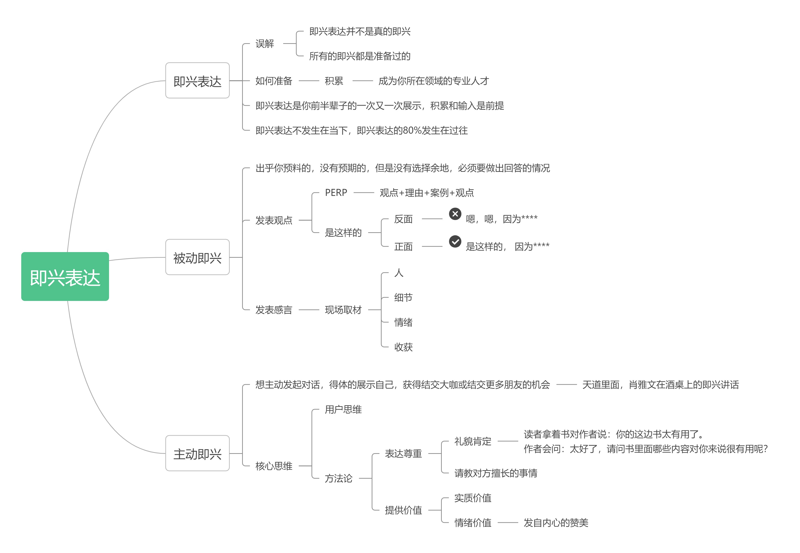
